Web interface
=============

This page gives an overview of every public-facing page of a RansomLook instance.
All pages are available on the official public instance at https://www.ransomlook.io.

Navigation is organised in three groups in the sidebar:

* **Data** — Recent, Browse, Trending, Stats
* **Intel** — URLs, Crypto, Leaks, Notes, RF Dumps
* **Info** — API, Glossary, About

Homepage (``/``)
----------------

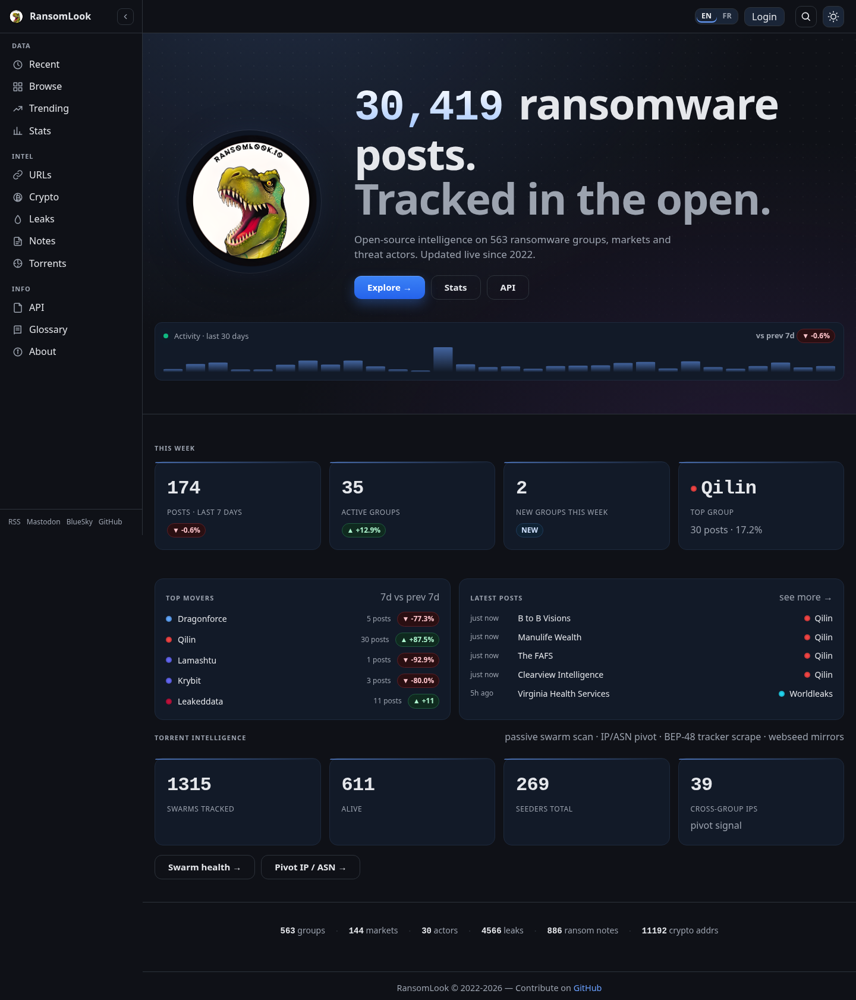

The landing page summarises live activity:

* total ransomware posts tracked,
* last 7-day headline metrics with delta vs the previous week,
* *Top movers* (groups with the biggest weekly swing) and *Latest posts*,
* a 30-day sparkline of the overall posting activity,
* CTAs towards :ref:`/recent <page-recent>`, :ref:`/stats <page-stats>` and the API docs.

.. _page-recent:

Recent posts (``/recent``)
--------------------------

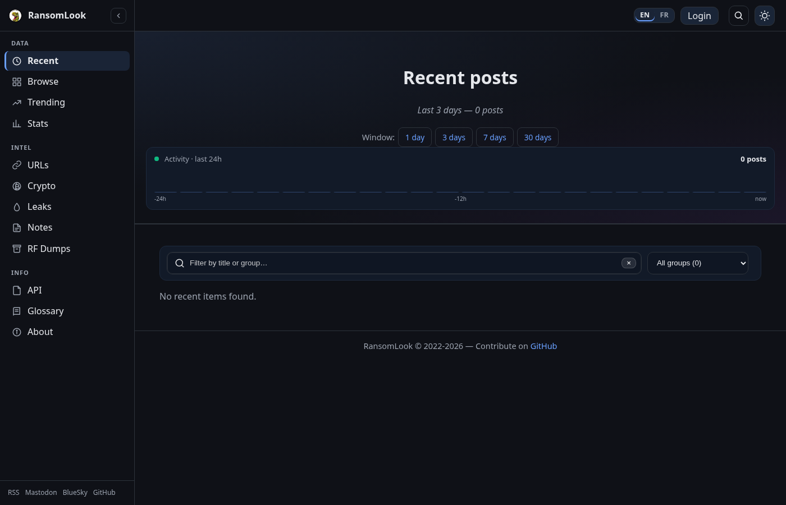

Flat chronological listing of victim posts across every tracked group.

* **Time window selector** — ``1 / 3 / 7 / 30 days``. Default window: 3 days.
* Hard cap at 2000 rows per window. When exceeded, a notice shows how many rows were trimmed.
* Live filters: free-text search (title + group name) and a per-group dropdown.
* 24-hour sparkline of posting activity in the hero.

.. _page-browse:

Browse (``/browse``)
--------------------

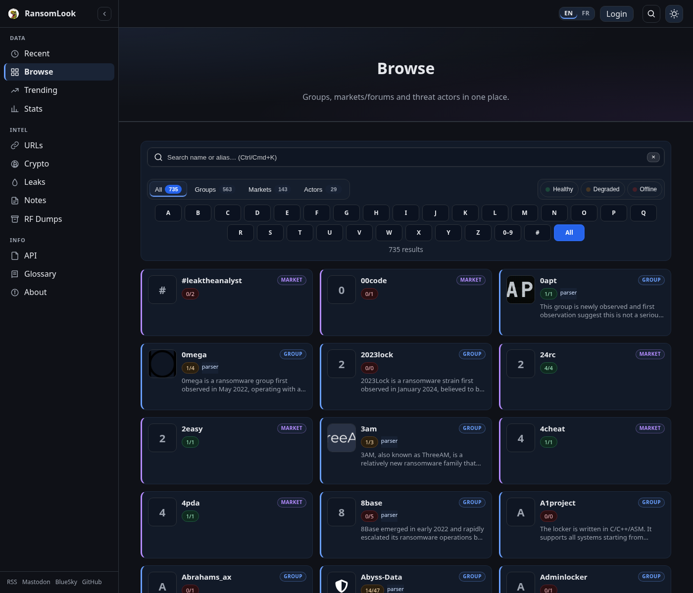

Card grid of every tracked entity — ransomware groups, markets/forums and threat actors.

* Tabs to switch between *All / Groups / Markets / Actors*.
* Health chips (*Healthy / Degraded / Offline*) filter entities by mirror availability.
* Alphabet bar (A-Z / 0-9 / #) and live name/alias search.
* Each card exposes parser status, private flag, wanted-listing flag, alias count.

.. _page-urls:

URLs (``/urls``)
----------------

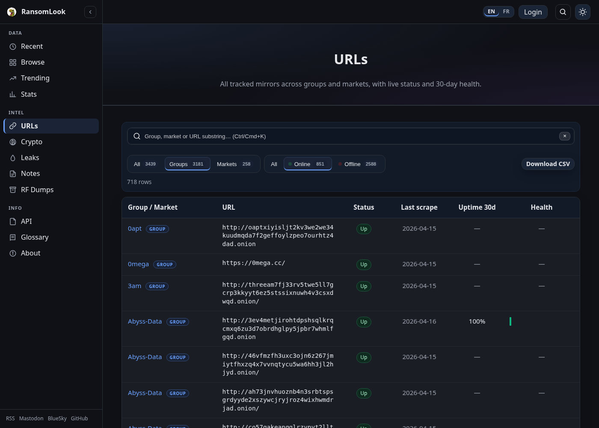

Flat view of every tracked mirror URL for groups and markets. Useful for IR teams
checking if an observed URL matches a tracked mirror.

* Filters: entity type (*All / Groups / Markets*), availability (*All / Online / Offline*),
  live text search matching both entity name and URL substring.
* One row per mirror — shows the entity, the full URL, live status, last scrape date,
  30-day uptime and a 30-day health sparkline.
* **CSV export** (``/urls.csv``) respects the active filters.
* Respects privacy: private entities and private URLs are hidden to anonymous visitors.

.. _page-hot:

Trending (``/hot``)
-------------------

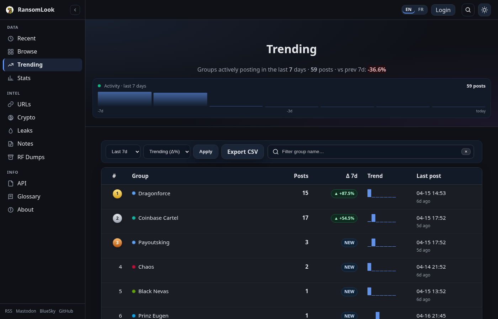

Ranks groups by posting activity over a configurable window (1/3/7/14/30/90 days).

* Sort modes: *Trending (Δ%)*, *Volume*, *New entrants*.
* CSV export of the ranked list.
* Per-row sparkline showing the daily post distribution inside the window.

.. _page-stats:

Stats (``/stats``)
------------------

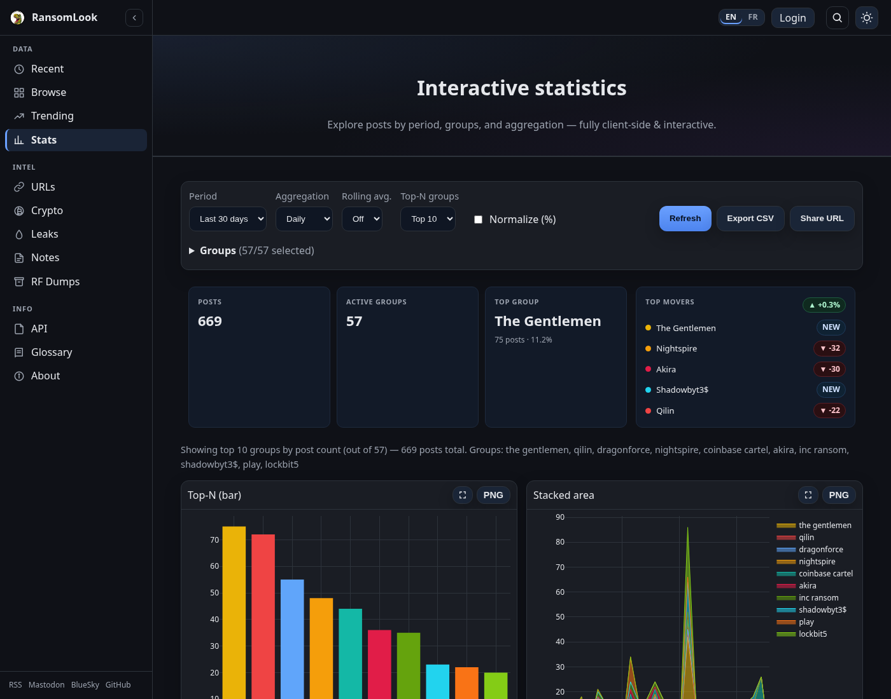

Interactive charts (Plotly) covering posts across time.

* Controls: time period (7/14/30/90 days or custom range), hourly/daily/weekly aggregation,
  optional rolling average (3/7/14), Top-N group filter (5/10/20/all), percentage normalisation.
* Three charts: Top-N bar, stacked area, timeline scatter. PNG export available on each.
* CSV export of the filtered dataset, share URL to reproduce a given view.

.. _page-compare:

Compare (``/compare``)
----------------------

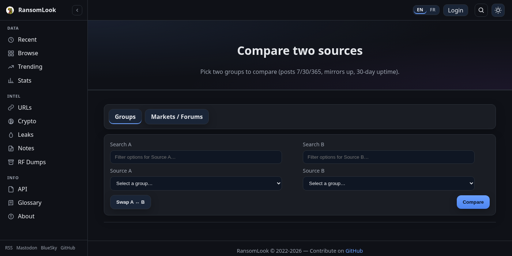

Side-by-side comparison of two entities (groups or markets/forums).

* Posts over 7d/30d/365d, mirrors up, 30-day uptime, Captcha and RaaS flags.
* Live charts: post volume bars + mirror availability gauges.

.. _page-crypto:

Crypto (``/crypto``)
--------------------

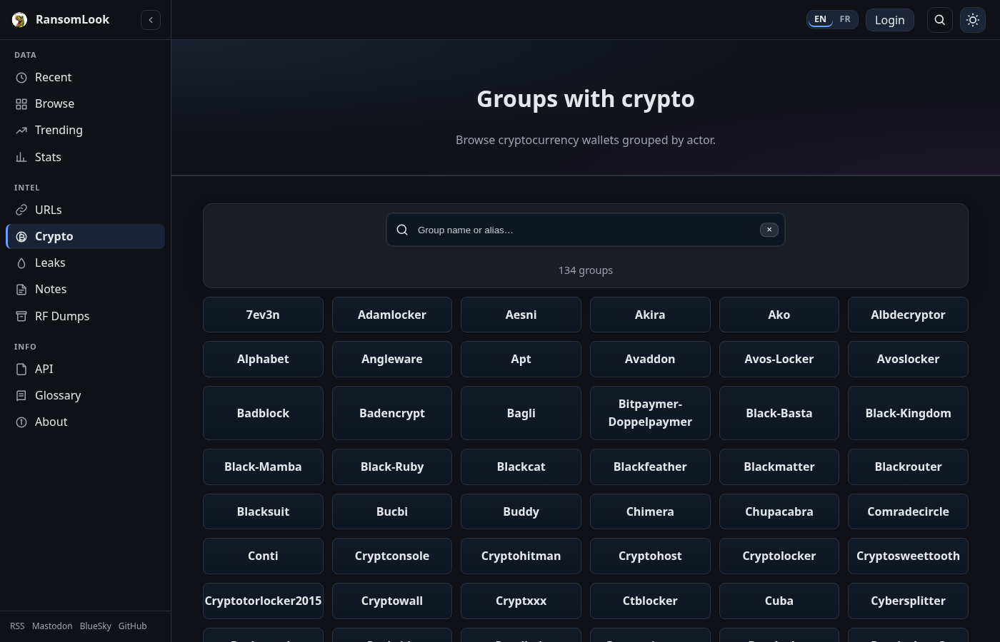

Cryptocurrency wallets grouped by actor.

* Chip grid with live filter by name / alias.
* Per-group detail page (``/crypto/<name>``) lists observed wallets by blockchain, each with
  their transactions, filter controls (date range, min/max amount, direction) and Breadcrumbs
  integration for supported chains.
* CSV export per wallet and per group.

.. _page-leaks:

Leaks (``/leaks``)
------------------

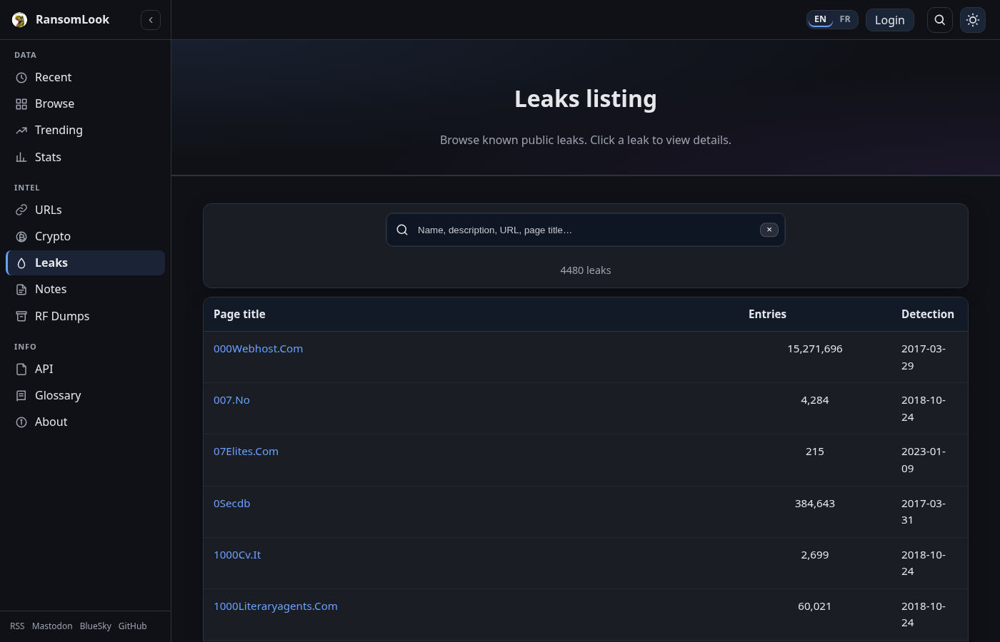

Public leak databases tracked for enrichment. Search by name/description/URL/title.
Each entry opens a modal with size, record count, indexing date and schema columns.

.. _page-notes:

Notes (``/notes``)
------------------

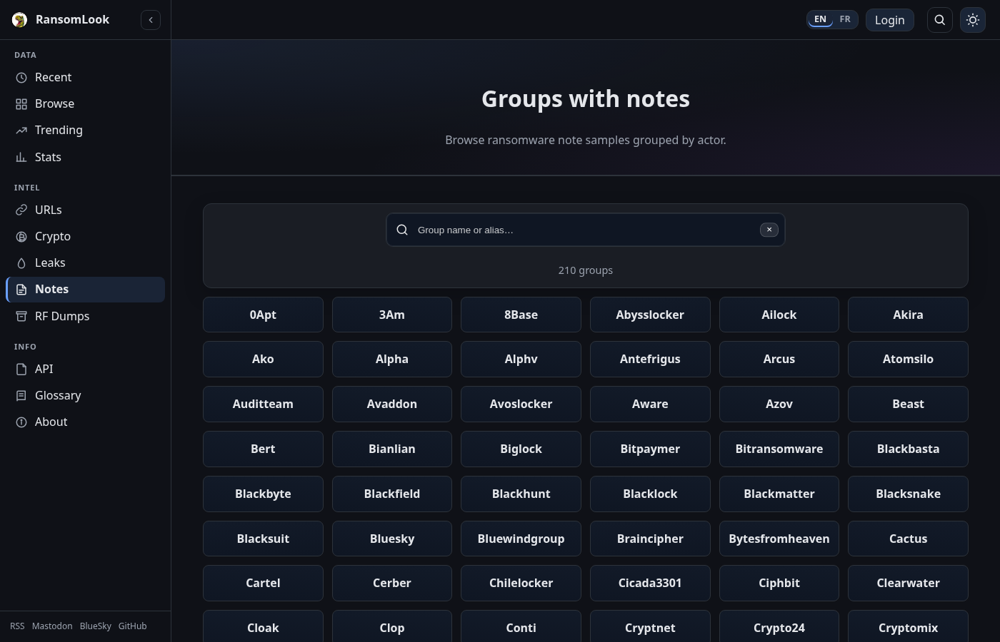

Ransom note samples grouped by actor. Detail page (``/notes/<group>``) lists every note
with content and a *Copy* action.

.. _page-rf:

RF Dumps (``/RF``)
------------------

Optional Recorded Future integration. Available when an API key is configured in
``config/generic.json``. Lists retrieved dumps with description and download date; modal
view shows breach metadata.

.. _page-torrent-health:

Torrent swarm health (``/torrent-health``)
------------------------------------------

Tracks the health of every BitTorrent magnet referenced by a post **or
manually attached to a group**. Read-only browsing is public; adding,
removing and force-rescanning are reserved to administrators.

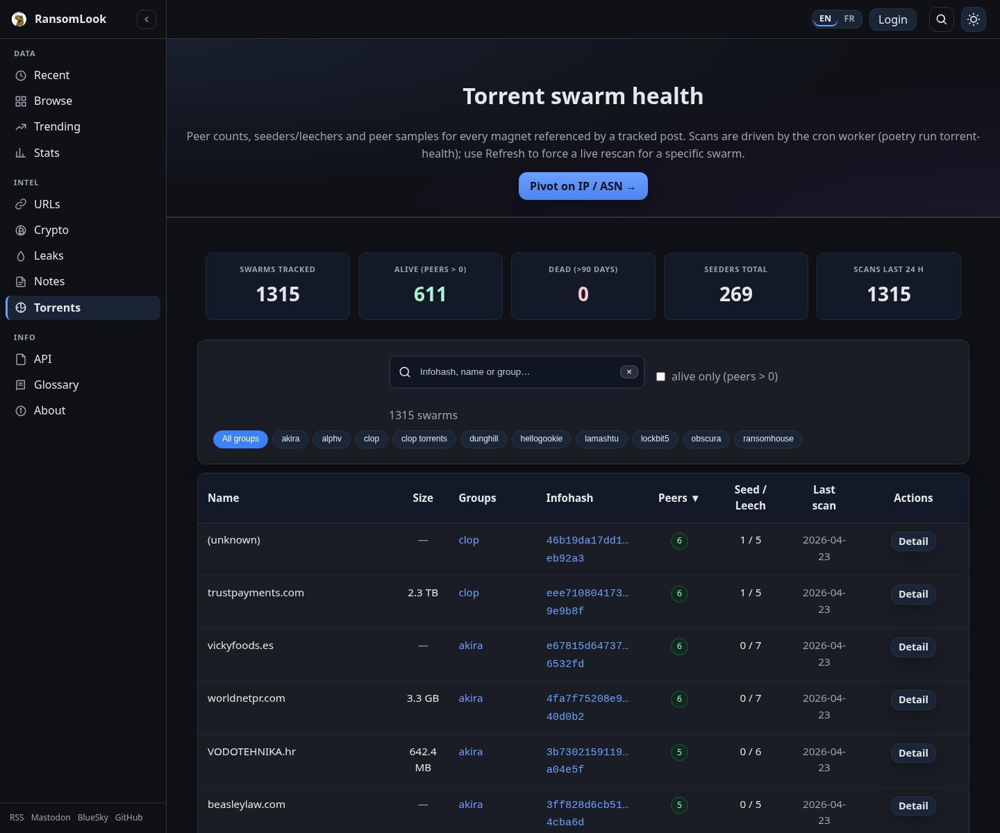

Scan pipeline:

* A cron worker (``poetry run torrent-health``) walks all magnets, extracts the
  infohash and joins each swarm passively. No per-torrent rate limit is applied:
  any piece data that flows during the short scan window is written to a
  dedicated tempdir that is wiped at batch end, so the node neither persists
  nor re-seeds content.
* For each scan the worker records ``seeders``, ``leechers``, total peer count,
  torrent size (when known) and a sample of peers with their IP, port,
  download percentage, client identification and observation source
  (DHT, PEX, tracker, LSD). A peer is counted as *seeder* when libtorrent
  flips its ``seed`` flag **or** when its observed ``progress`` reaches
  ≥ 99.9 % (handles peers that are complete but haven't exchanged the
  bitfield yet).
* Scan entries are kept for ``torrent_health.scan_retention_days`` days
  (auto-expire via Valkey TTL, default 30). Metadata for infohashes inactive
  for ``torrent_health.dead_threshold_days`` days is purged (default 90).
  Both values accept ``0`` to mean *keep forever*.
* IPs listed in ``torrent_health.ignored_ips`` are excluded from peer
  samples, indexes, pivots and exports. Use it to hide your own scanner host
  or known researcher nodes.

Public views:

* ``/torrent-health`` — the listing. Header banner shows five KPIs:
  *Swarms tracked / Alive / Dead / Seeders total / Scans last 24 h*. Below
  it, each column is sortable (click the header; default sort is *Peers*
  descending so live swarms surface first). The table carries a dedicated
  *Size* column and a free-text search (infohash, name or group). Filtering
  chips for every known group let you narrow to a single family in one click,
  and an *alive only* toggle hides dead swarms. Each row is tinted according
  to health (green for alive, amber for degraded, red for dead).
* ``/torrent-health/<infohash>`` — detail with KPIs, 30-day sparkline,
  latest peer sample (each IP / ASN linked to its pivot page), and the full
  history table. Historical rows are expandable to reveal that scan's peer
  sample.

Admin-only actions:

* A *Refresh now* button appears on the listing and detail pages **for
  logged-in admins only**. It triggers a live scan, rate-limited 1/min per
  caller and infohash. The scan runs in a background thread so the UI stays
  responsive; the button switches to *Scanning (N s)…* (where N is the
  configured ``scan_duration_seconds``) and reloads itself when the window
  is over. A running lock (TTL = scan_duration + 60 s safety) prevents
  concurrent refreshes on the same infohash.

Pivot intelligence (``/torrent-health/pivot``)
~~~~~~~~~~~~~~~~~~~~~~~~~~~~~~~~~~~~~~~~~~~~~~

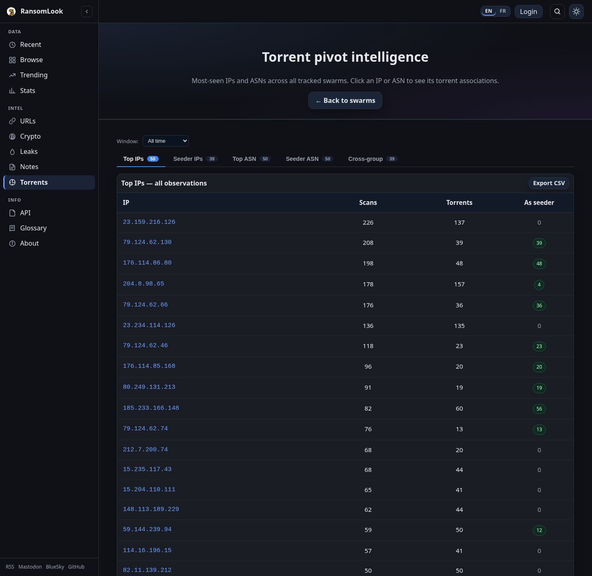

Public page exposing cross-torrent correlations: an analyst clicks an IP or
ASN anywhere in the app and lands here to see every torrent the peer has
touched. Five tabs:

* **Top IPs** — most-observed peers across all scans, with *seen / torrent /
  as-seeder* counters.
* **Seeder IPs** — same ranking restricted to observations flagged seeder.
* **Top ASN** — ranked by distinct IPs observed for that AS.
* **Seeder ASN** — AS with at least one confirmed seeder.
* **Cross-group** — IPs that appear in 2+ distinct ransomware groups. High
  signal: shared seedboxes, common actors, or researchers aggregating leaks.

A *Window* selector above the tabs restricts the computation to the last
*24h / 7d / 30d / 90d* (all-time by default). An *Export CSV* button on
each tab downloads the current view.

Per-IP (``/torrent-health/ip/<ip>``) and per-ASN
(``/torrent-health/asn/<asn>``) pages list every torrent the peer or AS has
touched, with role (seeder/leecher), last peer count and last scan. The
per-IP page also shows a 30-day SVG sparkline of its daily observation
counts (blue = seen, green = confirmed seeder).

Manage torrents (``/admin/torrent-health/manage``)
~~~~~~~~~~~~~~~~~~~~~~~~~~~~~~~~~~~~~~~~~~~~~~~~~

**Admin-only.** Attach a torrent to a ransomware group even when no post
references it (Telegram drops, forum-only leaks, private mirrors):

* *Single add*: pick a group, paste a magnet URI **or** upload a ``.torrent``
  file — the magnet is derived via libtorrent.
* *Bulk add*: paste one magnet per line (``#`` lines are ignored), pick a
  group, submit.
* *Delete*: per-row button or bulk via checkboxes.

Manually added torrents are merged with post-linked ones by
``collect_magnets()`` and picked up by the next cron run. The same action
is available at the CLI::

    poetry run tools/add_group_torrent.py --group clop --magnet "magnet:?xt=..."
    poetry run tools/add_group_torrent.py --group akira --torrent leak.torrent
    poetry run tools/add_group_torrent.py --group clop --from-file batch.txt
    poetry run tools/add_group_torrent.py --remove <infohash>

Static torrent metadata
~~~~~~~~~~~~~~~~~~~~~~~

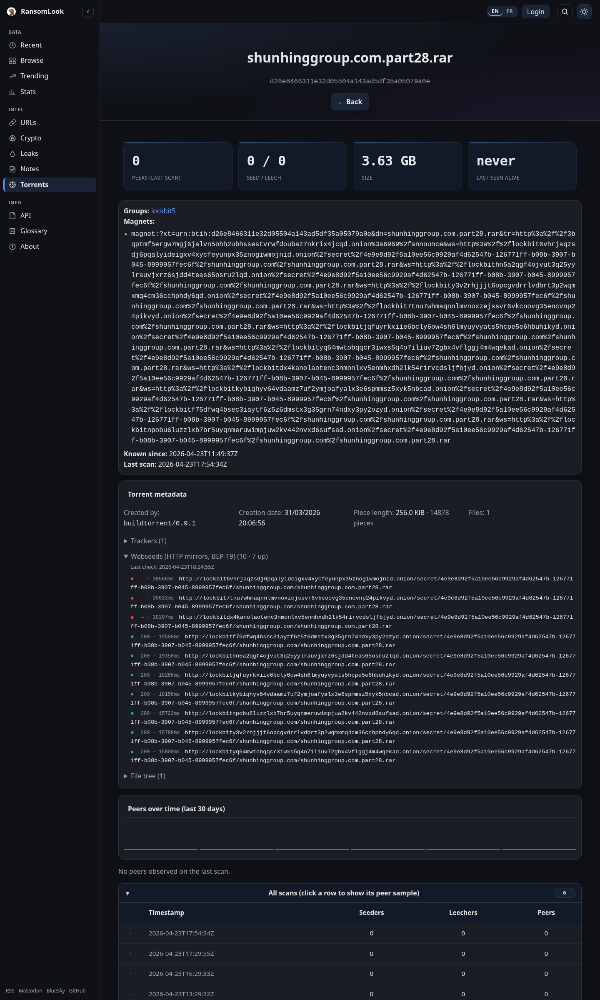

Beyond runtime swarm health, every ``.torrent`` file and magnet carries
static metadata — a goldmine for ransomware intel. RansomLook extracts
and persists the full info dict on add and on every scan:

* **created_by** — the client that produced the ``.torrent`` (e.g.
  ``qBittorrent/5.1.2``, ``mktorrent 1.1``, ``buildtorrent/0.9.1``).
  Fingerprints whether the affiliate is manual (GUI client) or automated
  (CLI-scripted packaging). Same creator across many leaks → same
  operator workflow.
* **creation_date** — Unix timestamp, rendered in the browser's local
  time.
* **comment** — free-form note left by the author.
* **trackers** — BEP-3 ``announce`` + BEP-12 ``announce-list``, fully
  merged.
* **webseeds** — BEP-19 HTTP mirrors (``url-list`` / ``httpseeds``).
  See the *Webseed liveness* section below.
* **files** — full ``{path, size}`` list of every file in the torrent.
  For multi-file leaks this exposes the victim's directory tree
  (``C:\Users\…\Documents\clients\…``), customer names, document types.
  Displayed as a collapsible table on the detail page (capped at 2000
  rows for rendering).
* **piece_length / num_pieces / private** — BT structure.

Magnet URIs contribute ``tr=`` (trackers) and ``ws=`` (webseeds) at add
time; the remaining fields arrive when libtorrent completes the info
dict fetch via DHT during the next scan. A single meta hash is kept per
infohash and enriched monotonically — existing values are not
overwritten by an emptier scan.

When the default scan window is too short for ``ut_metadata`` to finish
(large info dicts, slow peers), the row ends up with peers but no
name / size / files / trackers. The ``torrent-health-backfill`` CLI
rescans those incomplete rows with a longer window (default 300 s) —
safe to schedule daily, skips already-complete rows automatically. See
:ref:`command-line-interface` for flags.

Tracker scrape — BEP-48 (``poetry run torrent-tracker-scrape``)
~~~~~~~~~~~~~~~~~~~~~~~~~~~~~~~~~~~~~~~~~~~~~~~~~~~~~~~~~~~~~~

Groups with **private onion trackers** (LockBit, …) confound the
libtorrent scanner: DHT and uTP do not pass SOCKS5, so the scanner
reports 0 peer even when the swarm is active behind Tor. The
``torrent-tracker-scrape`` CLI side-steps that by issuing BEP-48
HTTP ``GET /scrape`` calls directly — Tor SOCKS5 for ``.onion``,
clearnet for everything else — and persists:

* **tracker_seeders / tracker_leechers** — current swarm size from the
  tracker's own bookkeeping.
* **tracker_downloaded** — total historical completions (a metric the
  peer-enumeration scanner cannot expose).
* **tracker_last_scrape / tracker_last_url** — audit trail.
* **tracker_history** — 30-point rolling window for a future sparkline.

Infohashes are grouped by scrape URL and submitted in batches (default
64 per request). Trackers that reject multi-infohash batches fall back
to one request per infohash automatically. UDP trackers (BEP-15) are
supported too via a native binary client; they go clearnet (UDP does
not pass SOCKS5) and are skipped automatically when ``only_onion`` is
set.

Config in ``generic.json``::

    "torrent_tracker_scrape": {
        "only_onion": true
    }

``only_onion: false`` (or ``--clearnet-too`` on the CLI) also scrapes
clearnet HTTP and UDP trackers. The ``downloaded`` counter returned by
those is a metric the libtorrent scanner does not expose, so running
the full scrape is worth the extra ~15-30 s even when the swarms are
otherwise covered.

Typical cron (single pass, every 3 h, onion + clearnet + UDP)::

    0 */3 * * * cd /opt/ransomlook && poetry run torrent-tracker-scrape --clearnet-too

The resulting numbers appear on ``/torrent-health/<infohash>`` as a KPI
banner labelled *Tracker scrape (BEP-48)*, and the last 30 samples are
kept in ``meta.tracker_history`` (≈3.7 days at 3 h cadence).

Webseed liveness check (``poetry run torrent-webseed-check``)
~~~~~~~~~~~~~~~~~~~~~~~~~~~~~~~~~~~~~~~~~~~~~~~~~~~~~~~~~~~~

Ransomware magnets typically embed a fleet of **BEP-19 webseeds** —
direct HTTP URLs to the leak file served by the operator's own mirror
infrastructure. A single LockBit magnet routinely carries 10+ mirrors
across distinct onion domains, which doubles as a map of the group's
distribution fabric.

``torrent-webseed-check`` issues a ``HEAD`` on every unique webseed URL
(falls back to a one-byte range ``GET`` when the server answers 405),
through Tor for ``.onion`` targets and direct for clearnet. For each
URL it records:

* ``online`` (boolean — ``2xx``/``3xx``), ``code`` (HTTP status),
  ``rtt_ms``, ``size`` (``Content-Length``), ``ts`` (check time),
  optional ``error`` (exception class when a connection fails).

Results are fanned out per infohash into the ``meta.webseed_status``
field and rendered on the torrent detail page as a **green / red dot**
next to every URL — a live view of mirror availability, ideal for
tracking takedowns and infrastructure churn per operator. The checker
is threaded (default 16 workers) and dedupes across infohashes that
advertise the same mirror.

Config::

    "torrent_webseed_check": {
        "onion_only": false
    }

Typical cron (every 6 h, complements the ``torrent-health`` and
``torrent-tracker-scrape`` jobs)::

    30 */6 * * * cd /opt/ransomlook && poetry run torrent-webseed-check

Torrent intel pipeline
~~~~~~~~~~~~~~~~~~~~~~

.. mermaid::

    flowchart LR
        A[Post parsed magnet extracted] --> B
        C[.torrent upload or add_group_torrent] --> B
        B[torrent-health cron DHT + BT scan] -->|peers, size, files, trackers, webseeds| D[(meta:&lt;ih&gt;)]
        D --> BF[torrent-health-backfill rescan incomplete rows longer ut_metadata window]
        BF -->|name, files, trackers| D
        D --> E[torrent-tracker-scrape BEP-48 + BEP-15 HTTP via Tor / UDP clearnet]
        D --> F[torrent-webseed-check HEAD via Tor]
        E -->|seeders, leechers, downloaded all-time| D
        F -->|online, code, rtt| D
        D --> G[/torrent-health/&lt;ih&gt; detail page]
        D --> H[/torrent-health/pivot IP / ASN / cross-group]
        D --> I[/api/torrent/* Swagger]

Programmatic access:

All ``/api/torrent/*`` and ``/api/enrich/*`` endpoints are registered in
the Swagger namespace and therefore visible on ``/doc``. Read endpoints are
public; the single write endpoint (refresh) requires an admin session or a
valid API key (``Authorization: <token>``).

Read endpoints (public):

* ``GET /api/torrent/health`` — paginated list, supports ``?alive=1`` and ``?q=``.
* ``GET /api/torrent/health/<infohash>`` — metadata + ``?history=N`` scans.
* ``GET /api/torrent/top/ips`` — top peers. ``?limit=`` ``?seed_only=1``
  ``?days=7|30|90`` (window) ``?format=csv``.
* ``GET /api/torrent/top/asn`` — same filters as top/ips, scoped to ASN.
* ``GET /api/torrent/top/cross-group`` — IPs spanning 2+ groups.
  ``?format=csv``.
* ``GET /api/torrent/ip/<ip>`` — enrichment + torrent associations. ``?format=csv``.
* ``GET /api/torrent/ip/<ip>/timeline`` — daily counts, last N days (default 30).
* ``GET /api/torrent/asn/<asn>`` — IPs + torrents for the AS. ``?format=csv``.

Write endpoint (admin session or API key):

* ``POST /api/torrent/refresh/<infohash>`` — queue a live rescan. Returns
  ``202 Accepted`` immediately; the scan runs in a background thread.
  Recorded in the audit log (``torrent_refresh``).

Peer IP enrichment
~~~~~~~~~~~~~~~~~~

Each peer IP observed during a scan is enriched via `CIRCL
<https://www.circl.lu/>`_ services:

* **ASN** — queried from `IP ASN History <https://ipasnhistory.circl.lu/>`_.
* **Organisation and country code** — queried from `BGP Ranking
  <https://bgpranking-ng.circl.lu/>`_.
* **Reverse DNS** — resolved locally, with a 2-second timeout.

Records are cached in ``DB_TORRENT_HEALTH`` under ``ipenrich:<ip>`` with a
TTL governed by ``torrent_health.ip_cache_ttl_days`` in the config (default
7 days; ``0`` disables the TTL).

Two endpoints expose the enrichment (same auth model as above — admin
session or API key):

* ``GET /api/enrich/ip/<ip>`` — single IP, optional ``?force=1`` bypass cache.
* ``POST /api/enrich/ip/bulk`` — batch up to 200 IPs per request (JSON
  ``{"ips": [...]}`` ). Used by the admin UI to enrich every peer of the
  displayed scan in one round-trip.

Enrichment runs in two complementary modes:

1. **Lazy (default)** — the admin detail page fetches the bulk endpoint at
   page load; uncached IPs hit CIRCL on demand.
2. **Proactive (optional)** — ``poetry run enrich-ips`` (cron job, typically
   daily) walks every stored peer IP and refreshes the cache so the UI is
   always instant.

Entity detail pages
-------------------

Group (``/group/<name>``)
~~~~~~~~~~~~~~~~~~~~~~~~~

* Hero with logo, quick stats (total posts, posts over 7d/30d, 30-day uptime average).
* Activity sparkline (30 days), Plotly time chart.
* Contact details (PGP, Matrix, Telegram, Tox, Session, Simplex, Max, Sonar, mail, Jabber).
* Mirror listings split by role (URLs / File servers / Chat / Admin) each showing status,
  screenshot thumb, 30-day uptime and a health sparkline.
* Affiliates list (linked to actor pages when known).
* CSV export for URLs and posts.

Market / Forum (``/market/<name>``)
~~~~~~~~~~~~~~~~~~~~~~~~~~~~~~~~~~~

Same layout as group pages but sourced from the market database.

Actor (``/actor/<name>``)
~~~~~~~~~~~~~~~~~~~~~~~~~

* Hero with aliases, *WANTED* banner linking to FBI / Europol / INTERPOL notices when applicable.
* Relation graph (cytoscape) showing linked groups, markets and peer actors.
* Personal information, contacts, sources and image gallery with lightbox.

Glossary (``/glossary``)
------------------------

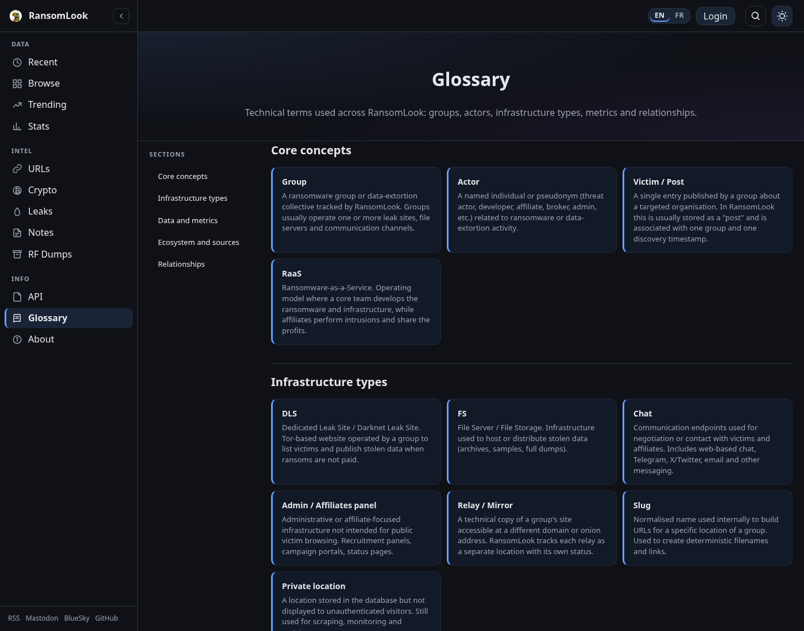

Reference page defining terminology used throughout RansomLook: groups, actors,
infrastructure types (DLS, FS, Chat, Admin, Relay), data metrics, ecosystem and relationships.

About (``/about``)
------------------

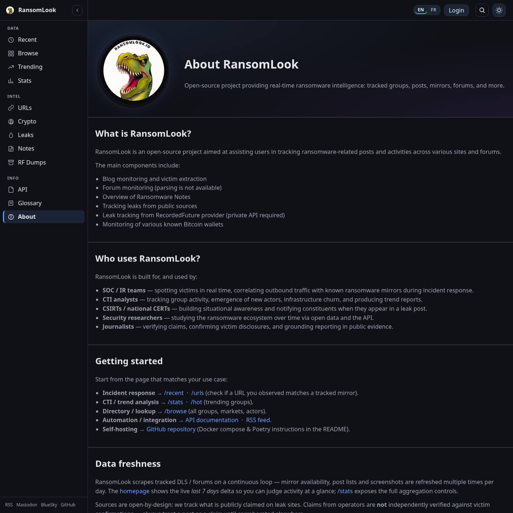

Project overview with sections:

* What is RansomLook / main components
* Who uses RansomLook (SOC, CTI, CSIRT, research, journalism)
* Getting started (entry-point per use case)
* Data freshness policy
* License (AGPL v3), API license (CC BY 4.0)
* Credits and external data sources

Feeds and automation
--------------------

RSS feed
~~~~~~~~

A ``/rss.xml`` feed exposes the most recent posts. The sidebar footer exposes a
direct link next to the social icons.

API
~~~

Swagger documentation is served at ``/doc/``. See :doc:`api` for details.

Language switcher
-----------------

Every page can be rendered in English or French. The switcher lives in the top bar
(``EN / FR``). The active locale is persisted in a cookie (``locale``) for one year.
When no cookie is set, the locale is picked from the browser's ``Accept-Language`` header,
defaulting to English.

See :doc:`i18n` for contributing new translations.
